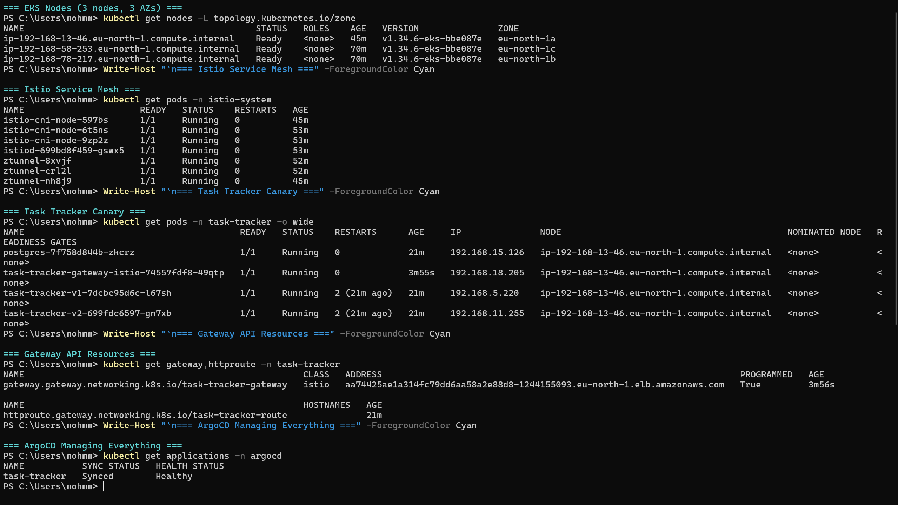
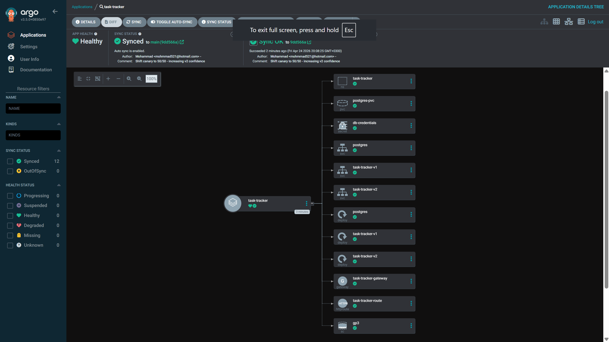
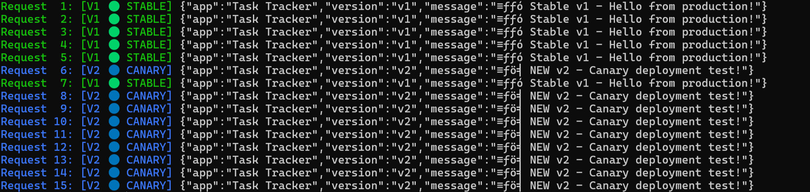
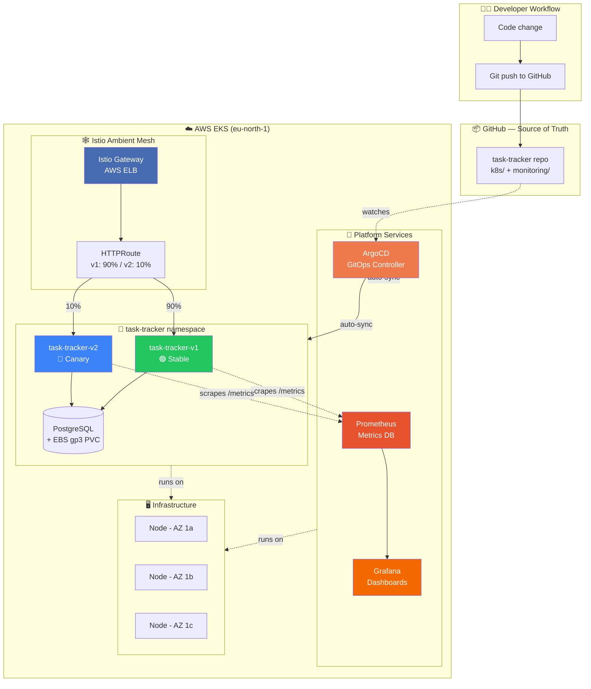

# 🚀 Task Tracker — Cloud-Native Platform


> A production-grade REST API platform built from scratch to exercise real cloud-native engineering: GitOps continuous delivery, canary releases through a service mesh, and full observability — all running on AWS EKS.

This started as a simple Python task tracker. It ended as a full cloud platform.

---

## 📸 What it looks like

<table>
  <tr>
    <td></td>
    <td></td>
  </tr>
  <tr>
    <td align="center"><em>Full stack on 3 nodes across 3 AZs: Istio mesh + canary pods + Gateway + ArgoCD</em></td>
    <td align="center"><em>ArgoCD managing v1 + v2 + Gateway + HTTPRoute as a single GitOps application</em></td>
  </tr>
</table>

<p align="center">
  
  <br/>
  <em>Live traffic split through Istio: ~50% to stable v1 (green), ~50% to canary v2 (blue)</em>
</p>

---

## 🎯 What this project demonstrates

A single repository containing the **entire deployment pipeline**, wired together the way real teams do it:

- A Python microservice with persistent state and exposed metrics
- Containerized and published to a public image registry
- Deployed to a production Kubernetes cluster on AWS
- Continuously delivered via **GitOps** — every commit auto-deploys
- Monitored end-to-end with **Prometheus + Grafana**
- Released safely via **Istio canary deployments** — 90/10 traffic splitting with zero downtime

Everything in this repo is the source of truth. `git push` is the only deploy command.

---

## 🏗️ Architecture



---

## 🛠️ Tech Stack

| Layer | Technology | Role |
|---|---|---|
| **Application** | Python 3.12, FastAPI, SQLAlchemy | REST API with Prometheus metrics |
| **Database** | PostgreSQL 16 | Persistent task storage |
| **Container** | Docker, Docker Hub | Image build + registry |
| **Orchestration** | Kubernetes 1.34 (AWS EKS) | Cluster runtime |
| **Storage** | AWS EBS CSI (gp3) | Dynamic persistent volumes |
| **Identity** | AWS IAM + OIDC (IRSA) | Pod-level AWS credentials |
| **GitOps** | ArgoCD 3.5 | Continuous deployment from Git |
| **Service Mesh** | Istio 1.29 (Ambient mode) | mTLS + traffic splitting |
| **Traffic Management** | Gateway API 1.4 | HTTPRoute canary weighting |
| **Observability** | Prometheus 2.54, Grafana 11.2 | Metrics + dashboards |

---

## ✨ Features

- **Full CRUD REST API** — `GET/POST/DELETE /tasks`, health checks, metrics endpoint
- **Native Prometheus instrumentation** — custom counters on request rate and tasks created
- **Persistent state** — PostgreSQL backed by dynamically provisioned EBS volumes
- **Zero-touch deployments** — `git push` triggers full cluster reconciliation
- **Self-healing** — ArgoCD reverts any manual cluster drift back to the Git state
- **Canary releases** — weighted traffic splitting between v1 and v2, tunable via YAML
- **Service mesh encryption** — pod-to-pod mTLS via Istio's ztunnel (no sidecars)
- **Live dashboards** — real-time request rate, endpoint breakdown, task creation rate

---

## 🚀 Quick Start

Deploy the whole stack to a fresh EKS cluster:

```bash
# 1. Create cluster (~15 min)
eksctl create cluster --name my-cluster --region eu-north-1 \
  --nodegroup-name my-nodes --node-type t3.small \
  --nodes 3 --nodes-max 3 --managed

# 2. Install EBS CSI driver
eksctl utils associate-iam-oidc-provider --cluster=my-cluster --region=eu-north-1 --approve
eksctl create iamserviceaccount --name ebs-csi-controller-sa --namespace kube-system \
  --cluster my-cluster --region eu-north-1 \
  --role-name AmazonEKS_EBS_CSI_DriverRole --role-only \
  --attach-policy-arn arn:aws:iam::aws:policy/service-role/AmazonEBSCSIDriverPolicy --approve
ACCOUNT_ID=$(aws sts get-caller-identity --query Account --output text)
eksctl create addon --name aws-ebs-csi-driver --cluster my-cluster --region eu-north-1 \
  --service-account-role-arn "arn:aws:iam::${ACCOUNT_ID}:role/AmazonEKS_EBS_CSI_DriverRole" --force

# 3. Install ArgoCD
kubectl create namespace argocd
kubectl apply -n argocd -f https://raw.githubusercontent.com/argoproj/argo-cd/stable/manifests/core-install.yaml
kubectl apply -f argocd-server.yaml

# 4. Install Istio Ambient (requires istioctl)
kubectl apply -f https://github.com/kubernetes-sigs/gateway-api/releases/download/v1.4.0/standard-install.yaml
istioctl install --set profile=ambient --skip-confirmation

# 5. Deploy everything via GitOps
kubectl apply -f task-tracker-app.yaml
kubectl apply -f monitoring-app.yaml

# 6. Watch ArgoCD pull your app from GitHub and deploy it
kubectl get pods -n task-tracker -w
```

Total time: ~30 minutes from zero to a running canary-deployed microservice with monitoring.

---

## 🔄 GitOps Workflow

The magic is that **nothing is deployed manually.** ArgoCD watches this repo and reconciles the cluster:

1. Developer edits code or manifests
2. `git commit && git push` to `main`
3. ArgoCD polls GitHub every 3 minutes (or via webhook)
4. If a drift is detected, ArgoCD applies the changes
5. `selfHeal: true` reverts any manual kubectl drift back to Git

Example flow — shipping a new app version:

```bash
# Edit the image tag in k8s/04-app.yaml
vim k8s/04-app.yaml  # change :v5 to :v6

git commit -am "Bump app to v6"
git push
# ☝️ That's the entire deployment
```

ArgoCD handles the rolling restart, pod readiness checks, and cleanup of the old version.

---

## 📊 Observability

Prometheus scrapes the app's `/metrics` endpoint every 15 seconds using **Kubernetes service discovery** — no manual target list. When pods scale or restart, Prometheus adjusts automatically.

The Grafana dashboard includes four panels:

| Panel | PromQL |
|---|---|
| Request Rate (per second) | `rate(http_requests_total[1m])` |
| Requests by Endpoint | `sum by (endpoint) (rate(http_requests_total[1m]))` |
| Tasks Created Per Minute | `rate(tasks_created_total[1m]) * 60` |
| Total Tasks Created | `tasks_created_total` |

Prometheus is deployed via ArgoCD from the `monitoring/` folder in this repo — monitoring itself is GitOps.

---

## 🎨 Canary Deployments with Istio

Two versions of the app run simultaneously. Istio's HTTPRoute decides how to split traffic based on a simple weight:

```yaml
apiVersion: gateway.networking.k8s.io/v1
kind: HTTPRoute
metadata:
  name: task-tracker-route
spec:
  parentRefs:
    - name: task-tracker-gateway
  rules:
    - backendRefs:
        - name: task-tracker-v1
          port: 80
          weight: 90   # 90% to stable
        - name: task-tracker-v2
          port: 80
          weight: 10   # 10% to canary
```

Hitting the endpoint 100 times gives the expected ~90/10 distribution. Changing the weights to `50/50` and pushing redistributes traffic **live** — no pod restarts, no downtime, rollbackable via `git revert`.

This is the same pattern used at companies like Netflix and Shopify for safe production rollouts.

**Test output:**

```
=== Istio Canary Deployment - Traffic Split Test ===
Results after 100 requests:
  V1 (stable)  : 48  (expected: ~50)
  V2 (canary)  : 52  (expected: ~50)
  Failed       : 0
```

---

## 🐛 Real Problems Solved

Building this surfaced plenty of production-style issues. A few highlights:

### Orphan AWS resources blocking cluster deletion
EKS doesn't automatically clean up `LoadBalancer`-type Services. Deleting the cluster before the Services leaves orphan ELBs + security groups that prevent VPC teardown. **Fix:** delete LoadBalancer services and PVCs *before* `eksctl delete cluster`.

### EBS volumes pinned to a single AZ
A PostgreSQL PVC provisions an EBS volume in one availability zone. If that zone's node is at pod capacity, scheduling fails even when other nodes have space. **Fix:** scale the nodegroup so each AZ has capacity, or use storage replicated across AZs.

### `t3.small` pod limit
AWS caps pods-per-node based on ENI count. `t3.small` = ~11 pods. With ArgoCD + Istio + Prometheus + app stack, this limit gets hit fast. **Fix:** scale to 3 nodes; consider `t3.medium` for production.

### YAML indentation kills GitOps
A single misindented line in a Kubernetes manifest stopped ArgoCD from deploying *anything*. Silent in local validation, loud in ArgoCD events. **Fix:** always `kubectl apply --dry-run=client -f` before committing.

### ArgoCD self-heal vs manual cleanup
Trying to manually delete a resource while ArgoCD is watching is a losing battle — it recreates it within seconds. **Fix:** delete the ArgoCD `Application` first, *then* the underlying resources.

---

## 🧠 Skills Demonstrated

<table>
<tr><td>

**Kubernetes**
- Deployments, StatefulSets, DaemonSets
- Services (ClusterIP, LoadBalancer)
- Gateway API (HTTPRoute)
- PersistentVolumeClaims, StorageClasses
- ConfigMaps, Secrets
- RBAC (SA, Role, ClusterRole, Bindings)
- Custom Resources (ArgoCD Applications)

</td><td>

**AWS**
- EKS cluster provisioning
- EBS CSI driver setup
- IAM OIDC + IRSA
- CloudFormation stack management
- Multi-AZ topology troubleshooting
- ELB / security group cleanup

</td></tr>
<tr><td>

**DevOps / SRE**
- Docker image build & publish
- GitOps with ArgoCD
- Prometheus instrumentation
- PromQL & Grafana dashboards
- Canary deployments
- Service mesh (Istio Ambient)
- mTLS pod-to-pod encryption

</td><td>

**Engineering**
- Python FastAPI + SQLAlchemy
- Lifespan context managers
- Health & readiness probes
- Resource requests & limits
- Horizontal scaling
- Production debugging
- Infrastructure as Code

</td></tr>
</table>

---

## 📂 Repository Layout

```
task-tracker/
├── k8s/                          # Application manifests (GitOps source)
│   ├── 00-storageclass.yaml      # gp3 EBS StorageClass
│   ├── 01-namespace.yaml         # Namespace + Istio mesh label
│   ├── 02-secret.yaml            # DB credentials
│   ├── 03-postgres.yaml          # PostgreSQL Deployment + PVC + Service
│   ├── 04-app.yaml               # task-tracker v1 + v2 Deployments + Services
│   └── 05-canary.yaml            # Istio Gateway + HTTPRoute (90/10 split)
│
├── monitoring/                   # Observability stack (GitOps source)
│   ├── 01-prometheus-rbac.yaml
│   ├── 02-prometheus-config.yaml
│   ├── 03-prometheus-deploy.yaml
│   └── 04-grafana.yaml
│
├── screenshots/                  # Proof it all worked
│
├── main.py                       # FastAPI application
├── requirements.txt              # Python dependencies
├── Dockerfile                    # Container build recipe
│
├── argocd-server.yaml            # ArgoCD server + RBAC
├── task-tracker-app.yaml         # ArgoCD Application for k8s/ folder
└── monitoring-app.yaml           # ArgoCD Application for monitoring/ folder
```

---

## 📝 License

MIT. Use it, break it, learn from it.

---

<p align="center">
Built end-to-end on AWS EKS as a hands-on exploration of cloud-native engineering.
</p>
